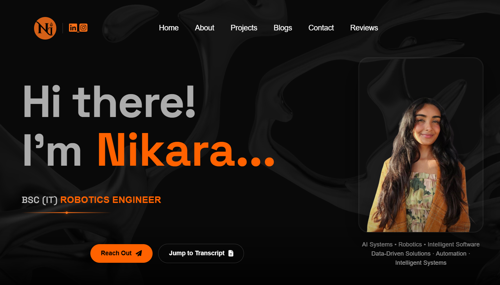

# Nikara Ishwarlall – Portfolio Website

This repository contains the source code for my personal portfolio website.

## Live Site

https://nikara17.github.io/Website-Portfolio/

## About

I am a Robotics and AI Systems engineer with an interest in building intelligent, reliable, and scalable solutions. This website serves as a central place to showcase my work, technical skills, and projects.

## Purpose

The goal of this project is to present my experience and projects in a clear and accessible format for recruiters, collaborators, and anyone interested in my work.

## Technologies

* HTML
* CSS
* JavaScript
* GitHub Pages for deployment

## Features

* Responsive layout for desktop and mobile
* Project showcase section
* Contact functionality
* Simple, maintainable structure

## Repository Structure

* `index.html` – main structure
* `style.css` – styling
* `app.js` – interactivity
* `images/` – assets

## Contact

* GitHub: https://github.com/nikara17
* LinkedIn: https://www.linkedin.com/in/nikara-ishwarlall

## Notes

This project is actively maintained and updated as I continue to develop new work and improve existing projects.
